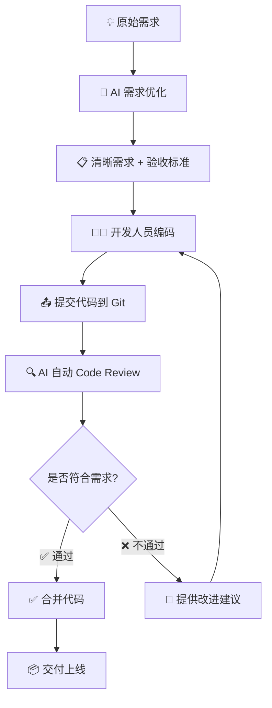

**DevFlow - AI 驱动的需求管理与智能代码审查平台**

副标题：从需求优化到代码审查的完整闭环

日期：2025年11月

---

## 目录

1. 项目背景与目标
2. 产品定位与价值
3. 核心功能概览
4. 完整闭环：从需求到代码
5. AI 需求优化（已完成）
6. AI 代码审查（下阶段重点）
7. 系统架构设计
8. 核心模块介绍
9. 项目管理与集成
10. 使用场景演示
11. 已完成功能展示
12. 下阶段规划
13. 技术亮点总结
14. 成本效益分析
15. Q&A

---

## 项目背景与目标

### 行业痛点
- 📊 **需求不清晰**：开发人员经常收到模糊的需求，导致理解偏差
- 🔄 **返工成本高**：需求变更和代码问题导致大量返工
- 👥 **Code Review 效率低**：人工审查耗时长，标准不统一
- 🧪 **质量把控难**：缺乏自动化的代码质量检查机制
- 📝 **知识断层**：需求与代码之间缺乏有效关联

### 项目目标：构建完整的质量闭环

```
清晰的需求 → 优质的代码 → 高效的交付
```

**核心理念**：
- ✅ 用 AI 优化需求，为开发提供清晰的需求文档和验收标准
- ✅ 基于优化后的需求，自动审查代码是否符合需求预期
- ✅ 建立从需求到代码的完整质量闭环
- ✅ 提升团队整体交付质量和效率

---

## 产品定位与价值

### 产品定位

**DevFlow = AI 需求优化 + AI 代码审查**

不仅仅是需求管理工具，更是代码质量保障平台

### 核心价值主张

#### 1️⃣ 需求侧（已实现）
- 📝 AI 自动优化需求描述
- ❓ 智能生成澄清问题
- ✅ 自动生成验收标准

#### 2️⃣ 代码侧（下阶段重点）
- 🔍 基于需求的智能代码审查
- ✅ 自动检查代码是否符合验收标准
- 📊 代码质量评分与改进建议


---

## 核心功能概览

### 🎯 两大核心能力

| 功能阶段 | 状态 | 核心价值 |
|---------|------|---------|
| **📝 AI 需求优化** | ✅ 已完成 | 将模糊需求转化为清晰、可执行的用户故事 |
| **🔍 AI 代码审查** | 🚧 下阶段重点 | 基于需求自动审查代码，确保实现符合预期 |

### 支撑功能

| 功能模块 | 说明 |
|---------|------|
| **项目管理** | 多项目、多成员协作管理 |
| **系统集成** | GitLab、禅道等 |
| **多 AI 支持** | 云端（通义千问）+ 本地（Ollama）|

---

## 完整闭环：从需求到代码

### 完整工作流程



---

## AI 需求优化（已完成）

### 功能详解

#### 1. 需求优化
**输入：** 简单的需求描述
```
用户登录功能
```

**AI 优化后：**
```
作为系统用户，我希望通过邮箱和密码登录系统，
以便访问我的个人工作区和项目信息。

功能描述：
- 用户输入邮箱和密码
- 系统验证用户凭证
- 登录成功后跳转到仪表板
- 失败时显示友好错误提示

验收标准：
✅ 支持邮箱+密码登录
✅ 密码强度至少8位，包含字母和数字
✅ 登录失败3次后要求验证码
✅ 支持"记住我"7天免登录
✅ 忘记密码功能可用
```

#### 2. 需求澄清
AI 自动生成澄清问题：
- ❓ 是否需要支持第三方登录（GitHub、Google）？
- ❓ 账号锁定策略是什么？
- ❓ 是否需要双因素认证？
- ❓ 密码重置的有效期多久？

#### 3. 测试用例生成
自动生成完整测试用例：
- ✅ 正常场景：正确邮箱密码登录成功
- ❌ 异常场景：错误密码、不存在用户、账号被锁定
- 🔒 安全场景：SQL注入、暴力破解防护
- 🎯 边界场景：空输入、特殊字符、超长密码

### 价值体现
- ⏱️ 需求编写时间：从 2 小时 → 15 分钟
- 📈 需求完整性：从 60% → 95%
- ✅ 标准化：统一的需求格式和验收标准

---

## AI 代码审查（下阶段重点）⭐

### 核心理念

**基于需求的智能代码审查**
- 不仅检查代码规范，更重要的是检查代码是否实现了需求
- 将验收标准作为审查依据
- 提供具体、可执行的改进建议

### 工作原理

```
1. 开发人员提交代码到 Git
2. Webhook 触发 DevFlow
3. AI 获取关联的需求和验收标准
4. AI 分析代码实现
5. 对比需求与实现，生成审查报告
6. 在 Git PR 中自动评论审查结果
```

### 审查维度

#### 1️⃣ 需求符合性检查 ⭐⭐⭐
- ✅ 是否实现了所有验收标准？
- ✅ 是否有遗漏的功能点？
- ✅ 实现逻辑是否符合需求描述？

#### 2️⃣ 代码质量检查
- 📏 代码规范性（命名、格式、注释）
- 🔒 安全性问题（SQL注入、XSS等）
- ⚡ 性能问题（N+1查询、内存泄漏）
- 🧪 测试覆盖率

#### 3️⃣ 改进建议
- 💡 具体的代码修改建议
- 📝 缺失功能的实现提示
- 🎯 最佳实践推荐

### 输出示例

```markdown
### AI Code Review 报告

#### ✅ 已实现的验收标准
- [x] 支持邮箱+密码登录
- [x] 登录成功跳转仪表板

#### ❌ 未实现的验收标准
- [ ] 登录失败3次后要求验证码 ⚠️
- [ ] 支持"记住我"功能 ⚠️

#### � 改进建议
1. 建议在 LoginController 中添加验证码逻辑
2. 建议使用 Redis 实现"记住我"功能
3. 密码加密建议使用 BCrypt 而非 MD5

#### � 代码质量评分：B+ (85/100)
```

### 技术实现方向
- Git Webhook 集成（GitHub、GitLab）
- AI 代码理解能力（使用 qwen-coder 模型）
- 需求-代码关联机制
- PR 自动评论功能

---

## 系统架构设计

### 整体架构

```
┌─────────────────────────────────────────┐
│        Web 前端 (Vue 3)                   │
│     • 需求管理界面                         │
│     • 代码审查结果展示                      │
└─────────────────┬───────────────────────┘
                  │ REST API
┌─────────────────▼───────────────────────┐
│      后端服务 (Spring Boot)                │
│  ┌──────────────────────────────────┐   │
│  │  需求管理模块                      │   │
│  │  • 需求 CRUD                      │   │
│  │  • AI 需求优化                     │   │
│  └──────────────────────────────────┘   │
│  ┌──────────────────────────────────┐   │
│  │  代码审查模块 (下阶段重点)          │   │
│  │  • Git Webhook 接收               │   │
│  │  • 代码获取与分析                  │   │
│  │  • AI 审查引擎                     │   │
│  └──────────────────────────────────┘   │
│  ┌──────────────────────────────────┐   │
│  │  AI 服务层                         │   │
│  │  • 统一 AI 接口                    │   │
│  │  • 多模型支持                      │   │
│  └──────────────────────────────────┘   │
└─────────────────┬───────────────────────┘
                  │
    ┌─────────────┴─────────────┐
    ▼                           ▼
┌─────────┐              ┌──────────────┐
│ MongoDB │              │  AI 模型      │
│ 数据存储 │              │ • 通义千问    │
└─────────┘              │ • Ollama     │
                         └──────────────┘
```

### 架构特点
- **前后端分离**：Vue 3 前端 + Spring Boot 后端
- **模块化设计**：需求模块与代码审查模块独立
- **AI 抽象层**：支持多种 AI 模型切换
- **可扩展性**：易于添加新的审查规则和集成

---

## 核心模块介绍

### 四大核心模块

#### 1. 需求管理模块 ✅
**功能**：
- 需求创建、编辑、查询
- AI 需求优化
- AI 澄清问题生成
- AI 测试用例生成
- 需求状态追踪

**状态**：已完成

#### 2. 代码审查模块 🚧
**功能**：
- Git 代码变更监听
- 需求与代码关联
- AI 代码分析
- 审查报告生成
- PR 自动评论

**状态**：下阶段开发重点

#### 3. 项目管理模块 ✅
**功能**：
- 项目创建与配置
- 团队成员管理
- 权限控制（OPERATOR/ADMIN/USER）
- Git 仓库集成
- 第三方系统集成（Jira、禅道）

**状态**：已完成

#### 4. AI 服务模块 ✅
**功能**：
- 统一 AI 接口
- 多模型支持（通义千问、Ollama）
- 模型切换机制
- Prompt 管理

**状态**：已完成

### 模块间协作

```
项目管理 → 需求管理 → 代码审查
    ↓          ↓          ↓
    └──────→ AI 服务 ←──────┘
```

---

## 项目管理与集成

### 项目管理能力

#### 核心功能
- **多项目管理**：支持创建和管理多个项目
- **团队协作**：项目管理员、成员管理
- **权限控制**：三级权限体系（OPERATOR/ADMIN/USER）
- **状态追踪**：项目进度和需求状态可视化

### 系统集成能力

#### Git 平台集成
- ✅ **GitHub**
- ✅ **GitLab**
- ✅ **Bitbucket**
- ✅ **Azure DevOps**

**用途**：
- 关联代码仓库
- 接收代码变更通知（用于代码审查）
- 自动评论 PR

#### 项目管理系统集成
- ✅ **Jira**
- ✅ **禅道（Zentao）**
- ✅ **Azure DevOps**
- ✅ **GitHub Issues**

**用途**：
- 需求自动同步
- 双向状态更新
- 统一管理入口

### 集成示例：禅道

```
DevFlow 创建需求
    ↓
自动调用禅道 API
    ↓
在禅道中创建 Story
    ↓
返回禅道 ID
    ↓
保存关联关系
```

---

## 使用场景演示

### 完整使用流程演示

#### 场景：开发一个用户登录功能

**阶段一：需求阶段** ✅ 已实现

1. **创建项目**
   - 配置 Git 仓库（如 GitHub）
   - 配置禅道集成
   
2. **输入简单需求**
   ```
   用户登录功能
   ```

3. **AI 优化需求** (点击一键优化)
   - 生成完整的用户故事
   - 生成验收标准（如：支持邮箱登录、密码加密、记住我等）
   - 生成澄清问题
   - 生成测试用例

4. **需求确认**
   - 产品经理确认需求
   - 自动同步到禅道
   - 分配给开发人员

**阶段二：开发阶段** 🚧 下阶段实现

5. **开发人员编码**
   - 查看清晰的需求和验收标准
   - 编写代码实现功能
   
6. **提交代码**
   - 推送代码到 GitHub
   - 创建 Pull Request

7. **AI 自动审查**
   - DevFlow 自动触发
   - 获取关联需求的验收标准
   - AI 分析代码实现
   - 在 PR 中自动评论审查结果

8. **审查结果**
   ```markdown
   ✅ 已实现：邮箱登录、密码加密
   ❌ 未实现：登录失败3次锁定、记住我功能
   💡 建议：添加验证码机制、使用 Redis 实现会话
   ```

9. **修改和合并**
   - 根据建议修改代码
   - 再次审查通过后合并

### 价值体现

| 环节 | 传统方式 | DevFlow 方式 | 提升 |
|------|---------|-------------|------|
| 需求编写 | 2 小时 | 15 分钟 | 88% ⬇️ |
| 需求理解 | 多次沟通 | 一次看懂 | 高效 |
| Code Review | 人工 1 小时 | AI 5 分钟 | 92% ⬇️ |
| 质量保障 | 靠经验 | AI + 标准 | 可靠 |

---

## 已完成功能展示

### 当前版本功能（v0.1.0）

#### ✅ 用户与权限管理
- 用户注册、登录
- GitHub OAuth2 登录
- 三级权限体系（OPERATOR/ADMIN/USER）
- 密码加密与安全认证

#### ✅ 项目管理
- 项目创建与配置
- 团队成员管理
- Git 仓库集成（GitHub、GitLab等）
- 项目管理系统集成（Jira、禅道）

#### ✅ AI 需求优化（核心功能）
- **需求优化**：将简单需求扩展为完整用户故事
- **验收标准生成**：自动生成清晰的验收标准
- **需求澄清**：AI 生成针对性澄清问题
- **测试用例生成**：覆盖正常、异常、边界场景
- **需求管理**：CRUD、状态追踪、标签分类

#### ✅ AI 能力
- 多模型支持（通义千问、Ollama）
- 云端与本地部署选项
- 灵活的模型切换机制

#### ✅ 系统集成
- 禅道自动同步
- GitHub 代码仓库关联
- 第三方系统 Webhook 支持

### 技术完成度

| 模块 | 完成度 |
|------|--------|
| 需求管理 | ✅ 100% |
| AI 需求优化 | ✅ 100% |
| 项目管理 | ✅ 100% |
| 用户管理 | ✅ 100% |
| 系统集成 | ✅ 90% |
| **代码审查** | 🚧 0%（下阶段重点）|

---

## 下阶段规划 - AI 代码审查 ⭐

### 开发计划（3个月）

#### 第一阶段：基础功能（1个月）
- [ ] **Git Webhook 集成**
  - 支持 GitHub Pull Request 事件
  - 支持 GitLab Merge Request 事件
  - 代码变更获取与解析

- [ ] **需求-代码关联**
  - PR 与需求自动关联
  - 通过分支名或 Commit 消息关联
  - 验收标准提取

- [ ] **基础审查能力**
  - AI 代码分析（使用 qwen-coder 模型）
  - 需求符合性检查
  - 生成基础审查报告

#### 第二阶段：增强功能（1个月）
- [ ] **深度审查**
  - 代码质量检查（命名、注释、复杂度）
  - 安全性扫描（SQL注入、XSS等）
  - 性能问题检测
  - 最佳实践建议

- [ ] **自动评论**
  - 在 GitHub PR 中自动添加审查评论
  - 支持行级别的代码建议
  - 审查结果可视化

- [ ] **审查规则配置**
  - 可自定义审查规则
  - 审查严格度设置
  - 白名单机制

#### 第三阶段：优化与完善（1个月）
- [ ] **学习优化**
  - 基于历史审查数据优化 AI 模型
  - 团队代码风格学习
  - 审查准确度提升

- [ ] **报告与统计**
  - 代码质量趋势分析
  - 团队代码审查看板
  - 问题分类统计

- [ ] **性能优化**
  - 大型代码库支持
  - 增量审查机制
  - 审查结果缓存

### 技术挑战

1. **代码理解能力**：需要 AI 准确理解代码逻辑
2. **准确性保障**：避免误报和漏报
3. **性能优化**：大代码库的快速审查
4. **Git 平台适配**：不同平台的 API 差异

---

## 技术亮点总结

### 核心技术亮点

1. **🎯 AI 原生设计**
   - 从需求优化到代码审查的完整 AI 闭环
   - 不是简单的功能叠加，而是深度集成

2. **🔗 需求-代码关联**
   - 验收标准作为代码审查依据
   - 可追溯的质量保障

3. **🤖 多 AI 模型支持**
   - 云端（通义千问）+ 本地（Ollama）
   - 满足不同场景的隐私和性能需求

4. **🔌 强大的集成能力**
   - Git 平台（GitHub、GitLab）
   - 项目管理系统（Jira、禅道）
   - Webhook 自动触发

5. **🏗️ 现代化架构**
   - 前后端分离（Vue 3 + Spring Boot 3）
   - 模块化设计，易扩展
   - RESTful API

6. **📊 灵活的数据模型**
   - MongoDB 文档数据库
   - 适应快速迭代

7. **🚀 多种部署方式**
   - Docker 容器化
   - 本地部署
   - 云端部署

8. **� 企业级安全**
   - JWT 认证
   - 数据加密
   - 权限控制

---

## 成本效益分析

### 效率提升

| 环节 | 传统方式 | DevFlow | 节省 |
|------|---------|---------|------|
| **需求编写** | 2 小时 | 15 分钟 | 88% ⬇️ |
| **需求澄清** | 多次会议 | AI 自动生成 | 90% ⬇️ |
| **测试用例** | 3 小时 | 20 分钟 | 89% ⬇️ |
| **Code Review**（规划）| 1 小时/PR | 5 分钟/PR | 92% ⬇️ |

### 质量提升

- **需求完整性**：60% → 95%
- **需求理解准确度**：70% → 95%
- **代码符合度**（规划）：70% → 90%
- **返工率**：降低 70%

### ROI 分析（年度，50人团队）

假设：
- 每人每周 2 个需求，每年 100 个需求
- 每个需求节省 5.5 小时（需求 + 澄清 + 测试用例）
- 每人每周 5 个 PR，每年 250 个 PR
- 每个 PR Code Review 节省 55 分钟（规划）

**年度节省**：
- 需求阶段：50人 × 100需求 × 5.5小时 = 27,500 小时
- 代码审查：50人 × 250PR × 0.92小时 = 11,500 小时
- **总计**：39,000 小时 ≈ **19 人年**

**投资回报率**：超过 1000%

---

## 项目统计

### 开发成果

#### 代码量
- **后端**：~15,000 行 Java 代码
- **前端**：~8,000 行 Vue/TypeScript 代码
- **文档**：20+ 份 Markdown 文档

#### 功能完成度

| 阶段 | 模块 | 完成度 | 说明 |
|------|------|--------|------|
| **已完成** | 用户管理 | ✅ 100% | 注册、登录、OAuth2 |
| | 项目管理 | ✅ 100% | CRUD、团队管理 |
| | 需求管理 | ✅ 100% | 完整生命周期 |
| | AI 需求优化 | ✅ 100% | 优化、澄清、测试用例 |
| | 系统集成 | ✅ 90% | Git、禅道 |
| **规划中** | AI 代码审查 | � 0% | 下阶段 3 个月 |

#### 测试覆盖
- 单元测试：60%+ 覆盖率
- 集成测试：核心流程全覆盖
- 功能测试：主要场景验证

### 部署方式
- ✅ 本地直接部署
- ✅ 生产环境部署脚本
