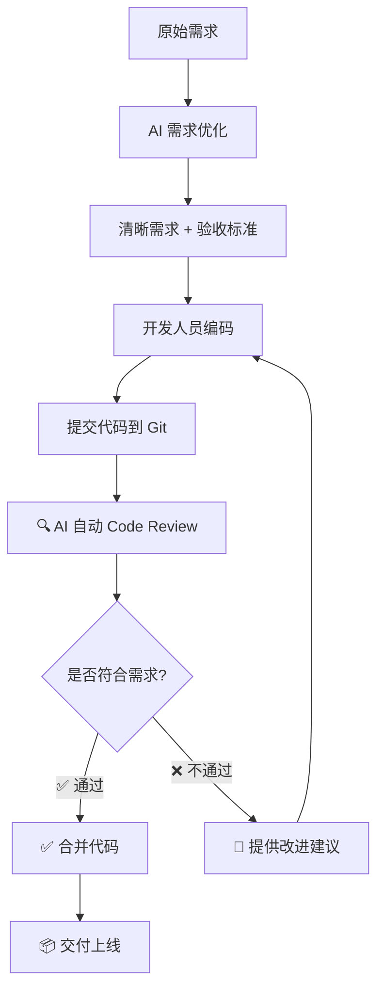

# DevFlow - AI 驱动的开发全流程助手

副标题：从需求优化到代码审查的完整闭环

日期：2025年11月

---

## 目录

[toc]{type: "ul", level: [2]}

---

## 项目背景与目标

### 行业痛点
- 📊 **需求不清晰**：开发人员经常收到模糊的需求，导致理解偏差
- 🔄 **返工成本高**：需求变更和代码问题易导致返工
- 👥 **Code Review 效率低**：人工审查耗时长，标准不统一
- 🧪 **质量把控难**：缺乏自动化的代码质量检查机制
- 📝 **知识断层**：业务知识和代码知识难于传递

### 项目目标：构建完整的质量闭环

```
清晰的需求 → 优质的代码 → 高效的交付
```

**核心理念**：
- ✅ 用 AI 优化需求，为开发提供清晰的需求文档和验收标准
- ✅ 基于优化后的需求，自动审查代码是否符合需求预期
- ✅ 建立从需求到代码的完整质量闭环
- ✅ 提升团队整体交付质量和效率

---

## 产品定位与价值

### 产品定位

**DevFlow = AI驱动的开发全流程助手**


### 核心价值主张

#### 1️⃣ 需求侧（已实现）
- 📝 AI 自动优化需求描述
- ❓ 智能生成澄清问题
- ✅ 自动生成验收标准

#### 2️⃣ 代码侧（下阶段重点）
- 🔍 基于需求的智能代码审查
- ✅ 自动检查代码是否符合验收标准
- 📊 代码质量评分与改进建议


---

## 核心功能概览

### 🎯 两大核心能力

| 功能阶段 | 状态 | 核心价值 |
|---------|------|---------|
| **📝 AI 需求优化** | ✅ 已完成 | 将模糊需求转化为清晰、可执行的用户故事 |
| **🔍 AI 代码审查** | 🚧 下阶段重点 | 基于需求自动审查代码，确保实现符合预期 |

### 支撑功能

| 功能模块 | 说明 |
|---------|------|
| **多租户管理** | 多项目、多成员协作管理 |
| **系统集成** | GitLab、禅道等 |
| **多 AI 支持** | 云端（通义千问）+ 本地（Ollama）|

---

## 完整闭环：从需求到代码

### 完整工作流程



---

## AI 需求优化（已完成）

### 功能详解

**输入：** 简单的需求描述
```
新建数据库表目录，并支持新建子目录。
```

#### 1. 需求澄清
AI 自动生成澄清问题：


#### 2. 需求优化


**AI 优化后：**
```
在数智中台的数据库管理界面中，需提供创建数据库表目录及其子目录的功能，以提升表组织效率并缩短查询时间。目录结构应以树形视图或面包屑导航方式可视化呈现，支持用户直观地浏览和管理层级关系。

具体功能要求如下：
- 用户（数据库管理员、数据工程师）可创建新目录，填写字段包括：**名称**（长度限制为100个字符）、**描述**（可选）、**父目录**（可选，若未选择则创建为根目录）。
- 支持创建多级子目录，最大深度无硬性限制，但系统整体需支持至少100个目录而不出现性能下降。
- 目录创建后，允许用户对其进行**删除**（仅当目录为空时）或**移动**至其他父目录下。
- 所有目录操作需遵循基于角色的权限管理（RBAC），仅授权角色（数据库管理员、数据工程师）可执行创建、编辑、移动、删除等操作。
- 界面需提供清晰的层级导航能力，例如树形结构展示与面包屑路径，便于用户快速定位和切换目录。

验收标准：
- **AC1：创建根目录**  
  Given 我是具有权限的数据库管理员或数据工程师  
  When 我在数据库管理界面点击“新建目录”，输入名称（≤100字符）、可选描述，并不选择父目录  
  Then 系统成功创建一个根目录，并在树形视图中立即显示

- **AC2：创建子目录**  
  Given 我已有一个现有目录  
  When 我在该目录下点击“新建子目录”，输入有效名称和描述，并指定该目录为父目录  
  Then 系统成功创建子目录，并在树形结构中正确嵌套显示

- **AC3：目录命名校验**  
  Given 我尝试创建一个名称超过100个字符的目录  
  When 提交表单  
  Then 系统提示“目录名称不能超过100个字符”，并阻止提交

- **AC4：空目录删除**  
  Given 我有一个不含任何子目录或表的目录  
  When 我执行删除操作  
  Then 系统成功删除该目录

- **AC5：非空目录不可删除**  
  Given 我有一个包含子目录或表的目录  
  When 我尝试删除该目录  
  Then 系统提示“目录非空，无法删除”，并阻止操作

- **AC6：目录移动**  
  Given 我有两个目录 A 和 B，且 A 不是 B 的子目录  
  When 我将目录 A 移动到目录 B 下  
  Then 系统更新 A 的父目录为 B，并在树形视图中正确反映层级变化

- **AC7：权限控制**  
  Given 我是非授权用户（如普通分析师）  
  When 我尝试创建、删除或移动目录  
  Then 系统拒绝操作并提示“无权限执行此操作”

- **AC8：界面导航**  
  Given 我位于某子目录页面  
  When 查看界面  
  Then 系统显示面包屑导航路径（如：根目录 > 子目录1 > 当前目录）及完整的树形目录结构
```


### 价值体现
- ⏱️ 需求编写时间：减少编写时间
- 📈 需求完整性：大幅度提高user story的完整性
- ✅ 标准化：统一的需求格式和验收标准

---

## AI 代码审查（下阶段重点）⭐

### 核心理念

**基于需求的智能代码审查**
- 不仅检查代码规范，更重要的是检查代码是否实现了需求
- 将验收标准作为审查依据
- 提供具体、可执行的改进建议

### 工作原理

```
1. 开发人员提交代码到 Git
2. Webhook 触发 DevFlow
3. AI 获取关联的需求和验收标准
4. AI 分析代码实现
5. 对比需求与实现，生成审查报告
6. 在 Git PR 中自动评论审查结果
```

---

## 系统架构设计

### 整体架构

```
┌─────────────────────────────────────────┐
│        Web 前端 (Vue 3)                   │
│     • 需求管理界面                         │
│     • 代码审查结果展示                      │
└─────────────────┬───────────────────────┘
                  │ REST API
┌─────────────────▼───────────────────────┐
│      后端服务 (Spring Boot)                │
│  ┌──────────────────────────────────┐   │
│  │  需求管理模块                      │   │
│  │  • 需求 CRUD                      │   │
│  │  • AI 需求优化                     │   │
│  └──────────────────────────────────┘   │
│  ┌──────────────────────────────────┐   │
│  │  代码审查模块 (下阶段重点)          │   │
│  │  • Git Webhook 接收               │   │
│  │  • 代码获取与分析                  │   │
│  │  • AI 审查引擎                     │   │
│  └──────────────────────────────────┘   │
│  ┌──────────────────────────────────┐   │
│  │  AI 服务层                         │   │
│  │  • 统一 AI 接口                    │   │
│  │  • 多模型支持                      │   │
│  └──────────────────────────────────┘   │
└─────────────────┬───────────────────────┘
                  │
    ┌─────────────┴─────────────┐
    ▼                           ▼
┌─────────┐              ┌──────────────┐
│ MongoDB │              │  AI 模型      │
│ 数据存储 │              │ • 通义千问    │
└─────────┘              │ • Ollama     │
                         └──────────────┘
```

---

## 核心模块介绍

### 四大核心模块

#### 1. 需求管理模块 ✅
**功能**：
- 需求创建、编辑、查询
- AI 需求优化
- AI 澄清问题生成
- AI 测试用例生成
- 需求状态追踪

**状态**：已完成

#### 2. 代码审查模块 🚧
**功能**：
- Git 代码变更监听
- 需求与代码关联
- AI 代码分析
- 审查报告生成
- PR 自动评论

**状态**：下阶段开发重点

#### 3. 项目管理模块 ✅
**功能**：
- 项目创建与配置
- 团队成员管理
- 权限控制（OPERATOR/ADMIN/USER）
- Git 仓库集成
- 第三方系统集成（Jira、禅道）

**状态**：已完成

#### 4. AI 服务模块 ✅
**功能**：
- 统一 AI 接口
- 多模型支持（通义千问、Ollama）
- 模型切换机制
- Prompt 管理

**状态**：已完成

---

## 已完成功能展示

### 当前版本功能（v0.1.0）

#### ✅ 用户与权限管理
- 用户注册、登录、找回密码
- 三级权限体系（OPERATOR/ADMIN/USER）
- 密码加密与安全认证

#### ✅ 项目管理
- 项目创建与配置
- 团队成员管理
- Git 仓库集成（GitLab等）
- 项目管理系统集成（禅道）

#### ✅ AI 需求优化（核心功能）
- **需求优化**：将简单需求扩展为完整用户故事
- **验收标准生成**：自动生成清晰的验收标准
- **需求澄清**：AI 生成针对性澄清问题
- **测试用例生成**：覆盖正常、异常、边界场景
- **需求管理**：CRUD、状态追踪、标签分类

#### ✅ AI 能力
- 多模型支持（通义千问、Ollama）
- 云端与本地部署选项
- 灵活的模型切换机制

#### ✅ 系统集成
- 禅道自动同步

### 技术完成度

| 模块 | 完成度 |
|------|--------|
| 需求管理 | ✅ 100% |
| AI 需求优化 | ✅ 100% |
| 项目管理 | ✅ 100% |
| 用户管理 | ✅ 100% |
| 系统集成 | ✅ 50% |
| **代码审查** | 🚧 0%（下阶段重点）|

---

## 下阶段规划 - AI 代码审查 ⭐

### 开发计划（1个月）

#### 第一阶段：基础功能
- [ ] **Git Webhook 集成**
  - 支持 GitLab Merge Request 事件
  - 代码变更获取与解析

- [ ] **需求-代码关联**
  - PR 与需求自动关联
  - 通过分支名或 Commit 消息关联
  - 验收标准提取

- [ ] **基础审查能力**
  - AI 代码分析（使用 qwen-coder 模型）
  - 需求符合性检查
  - 生成基础审查报告

#### 第二阶段：增强功能
- [ ] **深度审查**
  - 代码质量检查（命名、注释、复杂度）
  - 安全性扫描（SQL注入、XSS等）
  - 性能问题检测
  - 最佳实践建议

- [ ] **自动评论**
  - 在 Gitlab PR 中自动添加审查评论
  - 支持行级别的代码建议
  - 审查结果可视化

- [ ] **审查规则配置**
  - 可自定义审查规则
  - 审查严格度设置
  - 白名单机制

### 技术挑战

1. **代码理解能力**：需要 AI 准确理解代码逻辑
2. **准确性保障**：避免误报和漏报
3. **性能优化**：大代码库的快速审查
4. **Git 平台适配**：不同平台的 API 差异

---

## 项目统计

### 开发成果

#### 代码量
- **后端**：~15,000 行 Java 代码
- **前端**：~8,000 行 Vue/TypeScript 代码
- **文档**：20+ 份 Markdown 文档

#### 功能完成度

| 阶段 | 模块 | 完成度 | 说明 |
|------|------|--------|------|
| **已完成** | 用户管理 | ✅ 100% | 注册、登录、OAuth2 |
| | 项目管理 | ✅ 100% | CRUD、团队管理 |
| | 需求管理 | ✅ 100% | 完整生命周期 |
| | AI 需求优化 | ✅ 100% | 优化、澄清、测试用例 |
| | 系统集成 | ✅ 50% | Git、禅道 |
| **规划中** | AI 代码审查 | � 0% | 下阶段 3 个月 |


### 部署方式
- ✅ 本地直接部署
- ✅ 生产环境部署脚本
